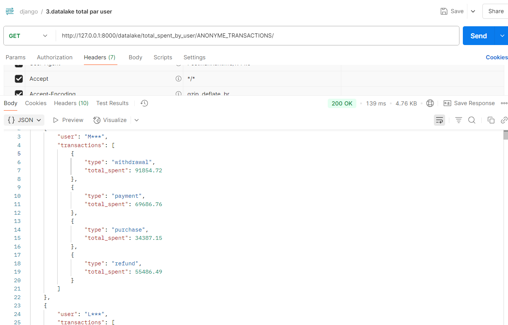

# TP API 2

contributeur :
Thomas COUTAREL
Joseph DESTAT GUILLOT

comme presentais en cours je vais vous montrer le projet effectué
On reste disponible si vous avez des problemes etc

Ce projet propose une API Django complète pour :
Ingérer et analyser des données issues de Kafka,
Les stocker dans un data lake local ou un data warehouse (SQLite),
Gérer les droits d'accès et l'authentification,
Fournir des métriques analytiques en temps réel,
Offrir une première base pour des mécanismes de traçabilité et versioning.

## Authentification & Autorisation

### Creation de token
Voici des captures d’écrans prouvant son fonctionnement :

Chaque utilisateur doit s’authentifier via un token pour accéder à l’API.
Le token est obtenu via une requête _POST_ avec le nom d’utilisateur et son mot de passe.
Ci dessous nous créons un token pour l'utilisateur couta et dont le mot de passe et ....


Une fois le token obtenu, il doit être utilisé dans les headers des requêtes suivantes :

```Token <votre_token>```
ensuite pour toute requete vers sur l'api nous avons 2 cas de figures :
- Accès autorisé avec un bon token :(a notifié dans les headers):


- a l'inverse si le token n'est pas notifié ou mauvais, l'utilisateur n'aura pas accès à la ressourse


### Attribution de droits d’accès

L’endpoint **grant_access** permet de donner à un utilisateur des droits en lecture et/ou en écriture sur une ou plusieurs ressources (topic ou dossier du data lake).
tous ces arguments sont à notifier dans le header de la requete, comme representais dans le screen ci dessous


### Révocation des droits

De la même maniere, L’endpoint **/revoke_access/** permet de retirer les accès précédemment accordés à un utilisateur sur une ressource.


## integration, liste et cleaner des données kafka à partir de l'api

#### data lake

Les messages Kafka peuvent être stockés soit dans un data lake (fichiers CSV par date), soit dans un data warehouse (base SQLite). Toutes les opérations sont déclenchées via des endpoints API.
L’endpoint **/datalake/** permet d’envoyer les messages d’un topic Kafka dans le data lake local.


Cela fonctionne avec tous les topics disponibles sur kafka, il suffit de modifier le body par le nom de la ressourse souhaitée.
par exemple, ci dessous on peut voir que j'ai 6 différentes topics ( tous est automatique et actions manuelle est nécessaire)


Ensuite les fichiers sont organisés comme suit dans le datalake:
```
data_lake/
└── <topic_name>/
    └── date=YYYY-MM-DD/
        └── fichier_1.csv
```

#### data warehouse

De meme manière, cela fonctionne pareil pour l'envoie des messages Kafka dans la base de données SQLite


Une fois insérés, les enregistrements sont visibles dans la base comme ci-dessous :


Par ailleurs, afin de facilité l'utilisation de l'api j'ai fait cette requete afin de savoir quel topics sont dipsonibles pour les topics kafka disponibles:


Mais aussi pour lister les ressources existantes dans le data lake:


L’endpoint **/clean/** permet de supprimer :
- Les fichiers du data lake plus vieux que la période de rétention (30 jours)
- Les enregistrements expirés dans le data warehouse!

[pb photo](tp3_project/screen/cleaner.png)

## Data retrieval

L’API permet de consulter les données en direct depuis Kafka (streaming) ou depuis le data lake (fichiers figés), selon la volonté de l’utilisateur.

L'utilisateur peut sélectionner le topic à interroger (si les droits lui sont accordés), directement via l'URL.
comment ca fonctionne :


comme presenté ci dessus, les routes ont toujours la meme forme et sont créer de maniere logique:
donc toujours le meme debut : ```http://127.0.0.1:8000/``` suivi de la methode d'écoute api correspondant a directement depuis kafka ou datalake.
Ensuite la commande/fonction que je vais vous presenté ci dessous.
Ensuite le topic choisi
et enfin le/les parametres si necessaires.

voici un exemple de requetes pour avoir les **resultats paginer** avec kafka sur le topic ```ANONYME_TRANSACTIONS```:


et fonctionne aussi en mode datalake sur un autre topic, par exemple 'BLACKLIST_TRANSACTIONS'


le parametres page peut etre changé en fonction de la page souhaité et il y aura toujours 10 messages par page

De meme maniere pour la **projection** (on change la fonction) avec kafka :


ou datalake; et on peut mettre plsuieurs parametres pour avoir une analyse plus fine comme :


Enfin pour les filtres :
ici, on voit que j'ai fais avec la methode directement sur kafka sur le topic ```ANONYME_TRANSACTIONS``` avec les filtres:
- ```PAYMENT_METHOD``` = paypal
- sur la page 1
- avec un ```AMOUNT_EUR__lt``` inferieur à 500


et on voit que les resultats retournés correspondent aux filtres

et de meme maniere cela fonctionne avec d'autre filtre sur le datalake sur le topic ```BLACKLIST_TRANSACTIONS``` avec les filtres:
- ```QUANTITY``` superieur à 1
- page egal à 1
- ```STATUS``` doit correspondre à processing


## metrics

Pour obtenir le **montant dépensé au cours des 5 dernières minutes** j'ai créer cette routes avec kafka sur le topic ```ANONYME_TRANSACTIONS```:


On voit que le montant dépensé est de 998012.3 euros.
et de meme maniere pour le datalake :


Maintenant afin d'obtenir le **total dépensé par utilisateur et par type de transaction** :
Cette requête agrège les montants par utilisateur (user) et par type de transaction.


et on voit bien le resultat que les noms sont uniques et qu'on a bien le total depensé par user unique

De meme maniere pour le datalake :



Enfin pour obtenir **les x produits les plus achetés**, x etant un entier à passer en paramètre


Ainsi on voit que la reponse nous renvoie bien 3 produits (x=3 ici) et que ce sont bien les 3 product_id etant les plus achetés


Ici nous voyons aussi que la reponse est bonne puisque j'ai notifié x=4 donc renvoie les 4 produits les plus achetés


## data lineage, audit and logs

Pour **obtenir une version spécifique des données stockées.** Si le contrôle de version est autorisé, renvoyer un code d'erreur.


Ainsi, ici on voit qu'on selectionne la version du 2025-06-04 est que l'accès est autorisé
A l'inverse de la capture d'écran ci dessous qui ```acces denied``` l'utilisateur puisqu'il n'a pas le droit requis


Pour obtenir l'identité de l'auteur de la requête ou de l'accès à une donnée/table spécifique.

Pour obtenir ces informations nous allons sur ce lien ```http://127.0.0.1:8000/admin/dataintegration/accesslog/``` permettant de voir toute les activités :


Par exemple ce screen donne de nombreuses informations comme la methode utilisé (get, post...), l'heure, l'utilisateur (grace au token) la requete effectuée...

Enfin pour obtenir la liste de toutes les ressources disponibles dans mon lac de données.

Pour obtenir ces informations nous allons soit directmeent dans le datalake disponible en local, ou sinon j'ai crée ces requetes permettant de recupérer les ressources disponible depuis kafka ou datalake:
Pour kafka :


Pour datalake:


Ainsi nous voyons que nous avons accès à :

```{
"resources": [
"ANONYME_TRANSACTIONS",
"BLACKLIST_TRANSACTIONS",
"MOYENNE_TRANSACTIONS_IMPORTANTES",
"TRANSACTIONS_STREAM",
"TRANSACTIONS_STREAM_V2",
"TRANSACTION_STATUS_COUNTS"
]
}
```

Correpondant à ce qu'on a en local


